# GitHub Copilot Edit mode

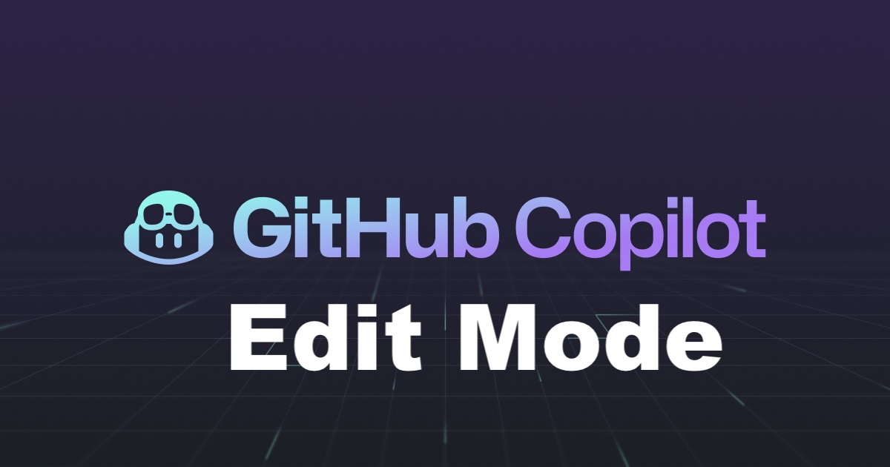

In this tutorial, you will learn how to leverage the GitHub Copilot feature called "Edit mode" to enhance your coding experience. Introduced with the release of Visual Studio 2022 version 17.13 and later, Copilot Edit is designed to help iterating across multiple-files more efficient.

Here is the link where you can find more about the GitHub Copilot Edit mode:

[GitHub Copilot Edit mode](https://code.visualstudio.com/docs/copilot/copilot-edits)

## Prerequisites

- Visual Studio 2022 version 17.13 or later
- GitHub Copilot extension installed
- GitHub Copilot license

Once you have that setup, make sure that you logged in to your GitHub account in Visual Studio Code. There are different ways to login, but the easiest way is to click on the `user icon` in the bottom left corner of the Visual Studio Code window and select `Sign in to GitHub`. This will open a new window where you can enter your GitHub credentials. Once you are logged in, you should click the `GitHub Copilot` icon in the top next to the search bar. This will give different options, and you should select `Open Chat`. This will open a new window where you can interact with the GitHub Copilot.

To use the GitHub Copilot Edit mode, you need to select the `Edit` option in the GitHub Copilot window. This will enable the Edit mode, which allows you to edit code across multiple files in your project.

## Introduction

**GitHub Copilot Edit** mode is a powerful feature that allows you to edit code across multiple files in your project. However, the caveat is that, with Copilot being generative in nature, it can generate different results each time you invoke it. This gives quite a challenge for someone who is writing a step-by-step tutorial, as the results may not be consistent. To mitigate this, will focus on the high level concepts and provide a few examples to illustrate the functionality of Copilot Edit mode. The biggest takeway for this tutorial is to understand how to use the Copilot Edit mode effectively, rather than focusing on what you really build with it through this tutorial.

> **Note:** Focus on the high level concepts and how to use the Copilot Edit mode effectively, rather than focusing on what you really build with it through this tutorial. The examples provided are just to illustrate the functionality of Copilot Edit mode.

One way to think about GitHub Copilot is like a football. You still have a control, but it can bounce in a different way.


For example, if I ask a question about `how to create a stock application`, I can get very different results based on when I try it.

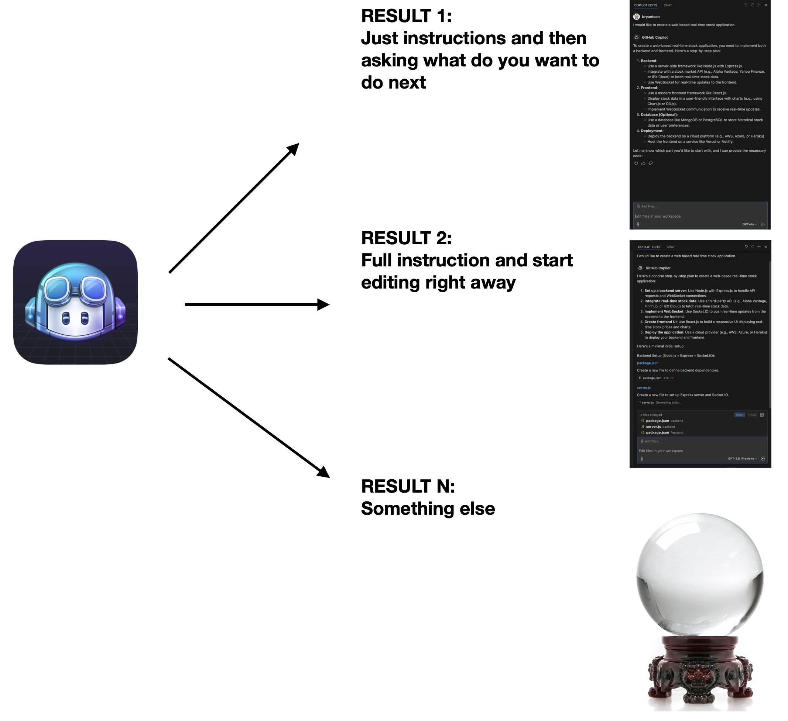

For a practioner, this is not bad but maybe even great! However, for someone who is writing a step-by-step tutorial, this can be a challenge. The results may not be consistent and it can be hard to follow along.

Thus, please remind yourself that the goal of this tutorial is to understand how to use the Copilot Edit mode effectively, rather than focusing on what you really build with it through this tutorial. The examples provided are just to illustrate the functionality of Copilot Edit mode.

Now, let's get started with the tutorial!

## Step 1: Start exploring the Copilot Edit mode window

We will start by exploring a simple example of how to use the Copilot Edit mode. Before you start, make sure that you met all the prerequisites above.

Once you have a Copilot Chat window open in `Edit mode`, it will look something like this:

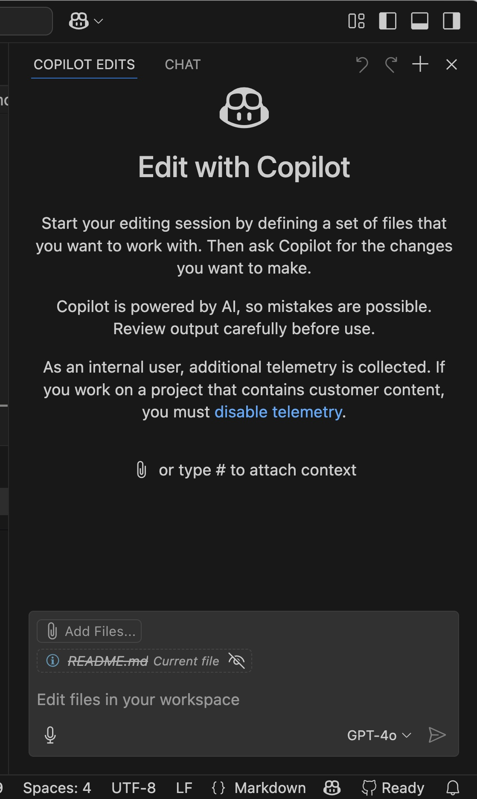

You have few options there, but let's take a look at two:

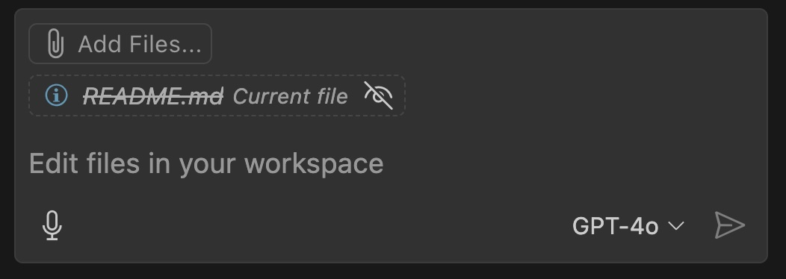

- `Add Files`: This will add files to your project. As you keep working on with Edit mode, it can automatically reference so it can use those files as the part of the context. However, to make it more relevant, you can manually add or remove files.
- `Model selection`: You can choose the model from the available options like `GPT-4o` or `Gemini 2.0 Flash`, etc. Your team may already give an instruction to use a specific model, or you may get different results based on the model you choose.

Later, you will see "agent mode," which is even one more step magical from the current Copilot Edit mode. For now, let's focus on the Edit mode and how to use it effectively.

## Step 2: Let's start with a very simple example first

Before we start, we need to add a folder so Copilot Edit can work from there. From the top menu, click **File** then select the **Add Folder to Workspace** option from the dropdown menu. This will open a new window where you can select the folder you want to add. Once you have selected the folder or created a new folder to add, click the **Add** button to add it to your workspace.

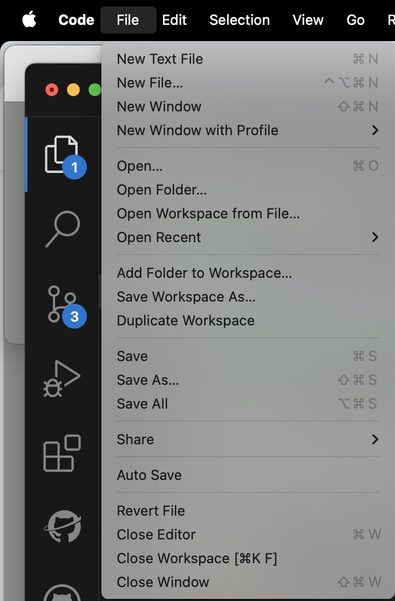

Next, we will create a new file in the folder we just added. To do this, right-click on the folder and select **New File** from the context menu. This will open a new file in the editor where you can start writing your code. I named my file as `calculator.js`.

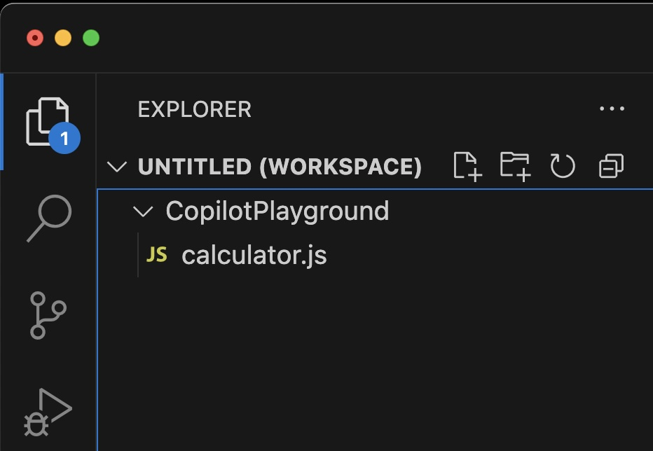

From the file we just created, we will start with a simple prompt. 

```javascript
// function to calculate the sum of two numbers
```

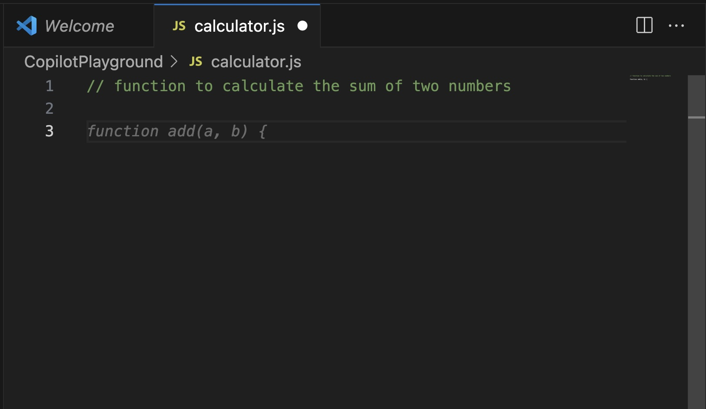

Once you have written the comment, you can hit the `Tab` key to let Copilot Edit mode generate the code for you. This will automatically generate the code based on the comment you wrote.

Hit the enter button to proceed further. Most likely, you will see GitHub Copilot suggesting another suggestion based on the previous pattern.

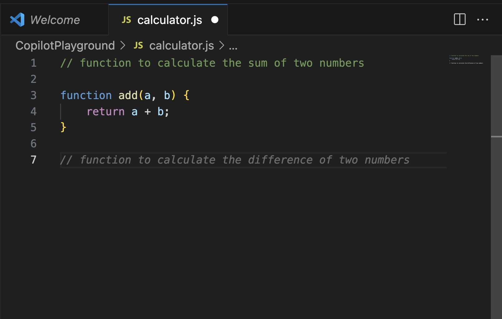

You can hit the `Tab` key and then `Enter` to accept the suggestion.

There is a cool feature within GitHub Copilot through in-file. In Windows, right click on either the selected lines or the file itself, then select `Copilot`. From there, you will see different options like `Explain` or `Fix`. For now, let's select `Explain` to see how Copilot can explain the code you just wrote.

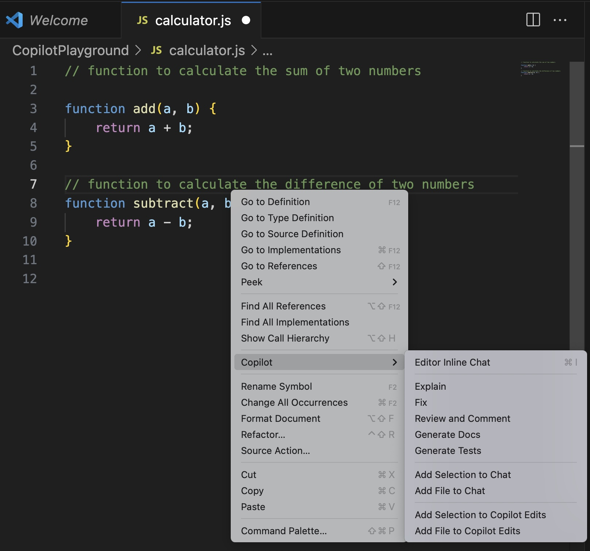

This will generate an explanation of the code you wrote through **Copilot Chat** panel. 

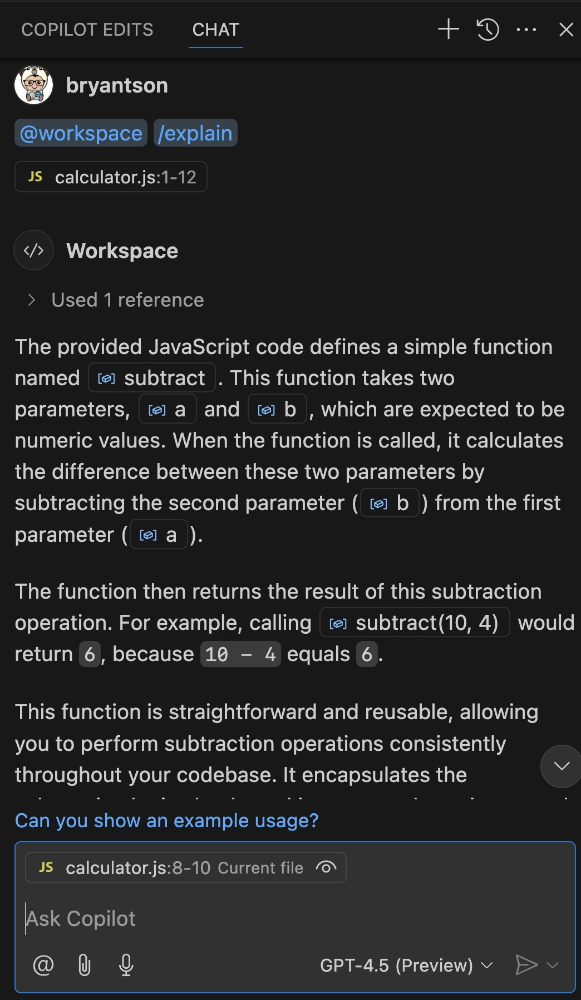

If you selected other option like `Editor Inline Chat`, you can even ask to change things without opening the Copilot Chat panel.

Next, we will finally try to leverage **GitHub Copilot Edit** mode. To do this, we will select the **Copilot Edits** option from the Copilot Chat panel. This will open a new window where you can start editing your code across multiple files in your project. From there, ask the following question:

```javascript
Can you implement the functionality to build different calculation examples?
```

The reason why we are asking such a simple question is that because we want to demonstrate somewhat more predictable answer from Copilot before going into too deeper dive into it. In this way, we can still grasp the value of Copilot Edit mode without getting lost in the details.

As soon as you asked, you will see GitHub Copilot picking up that file and started to work on it.

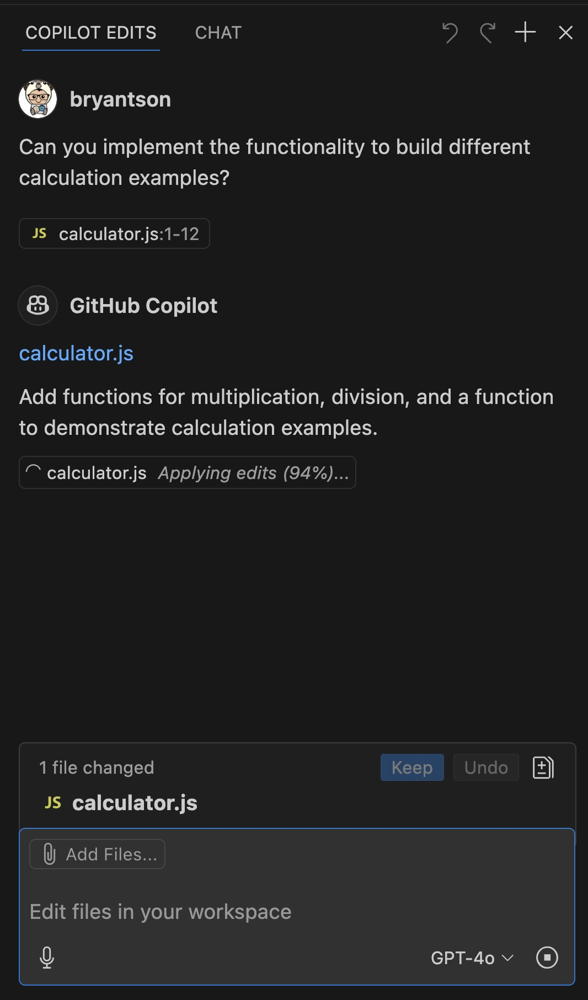

In your file, you will see that Copilot is doing some magic to generate the code.

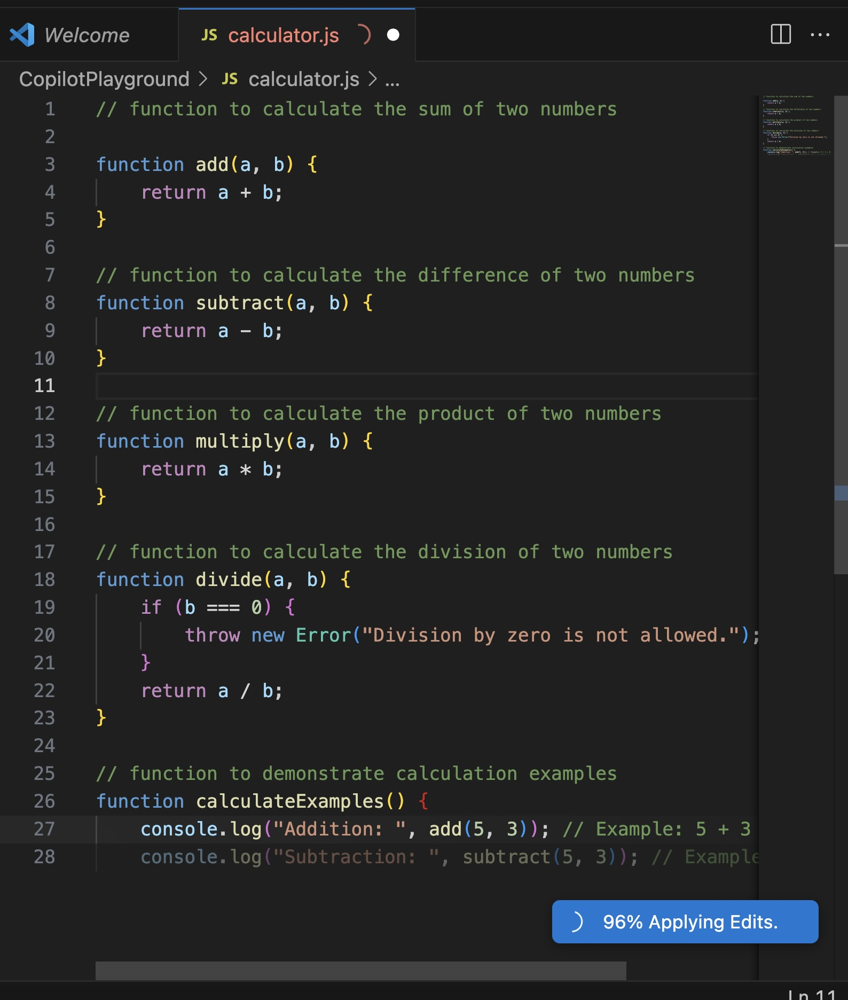

However, at the end of it, you will see that GitHub Copilot still waiting for you to accept the code.

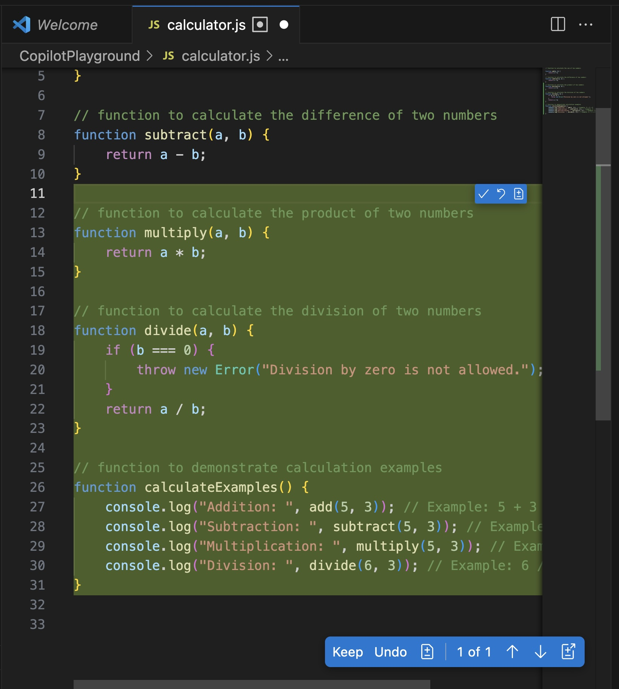

Once it is done, you will see that the GitHub Copilot Edit mode stopped working on the file.

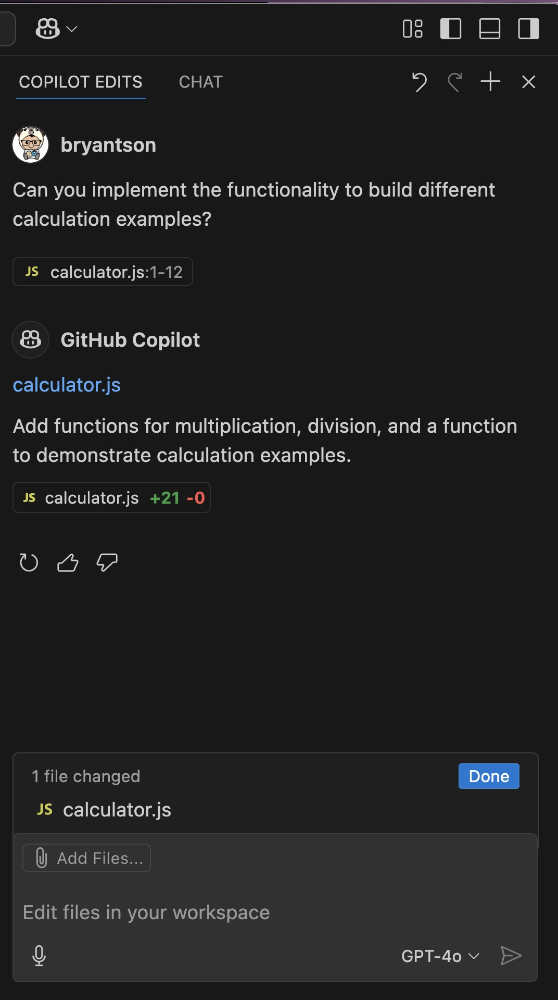

The main difference between the **Copilot Chat** and **Copilot Edit mode** is that the Copilot Edit mode actually can start modifying your files while the Copilot Chat just gives you suggestions and file lines where you can take further action. Later, within GitHub Copilot Agent mode, it will even have files to interact with the terminal to compile, run, and test your code.

Returning back to the Copilot Edit mode chat panel, what will happen if you hit that blue **Done** button?

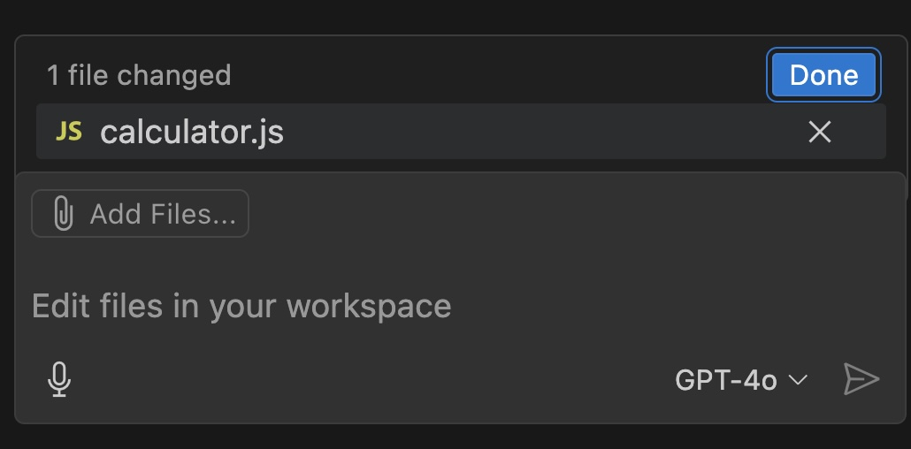

Let's hit that button now. You will see that action clears the Copilot Edit mode screen.

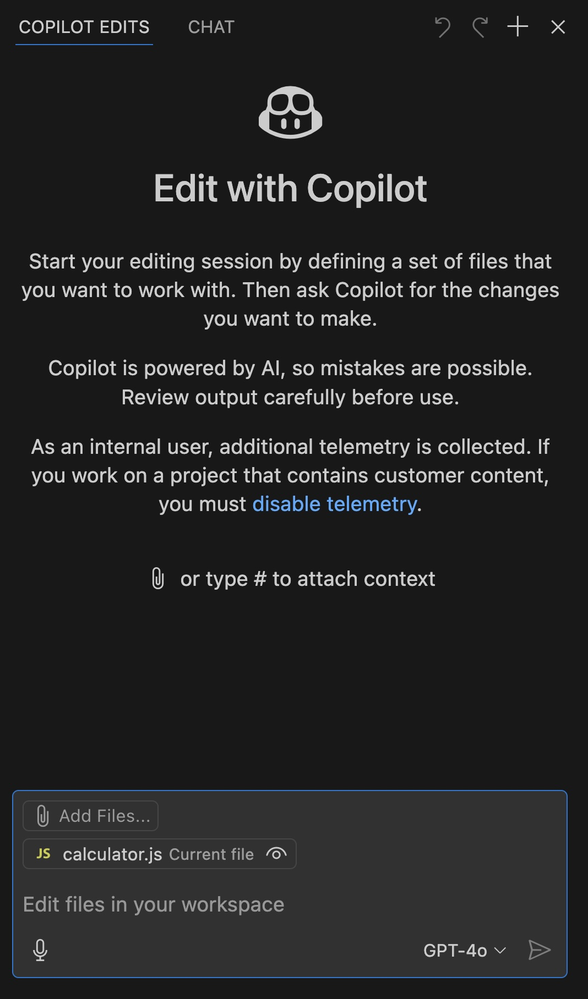

> **WARNING**: Be careful if you hit that button, because it will clear the Copilot Edit mode screen and you will lose all the context. So, make sure that you are done with your work before hitting that button.

That is it for our sample demonstration of **Copilot Edit** mode. Let's move on to little more complex but a cool example.

## Step 3: Let's build a stock management application

In this example, we will build a simple stock management application using the Copilot Edit mode. The goal is to demonstrate how to use the Copilot Edit mode to build a more complex application.

Now, if we type a general prompt like `Can you build a stock management application?`, we will get a very different results. That is maybe alright when you do it for yourself, but we want to have some sort of control because we have a variety of audiences who are following this tutorial. So, we will start with a more specific prompt. We call this **Prompt Engineering**.

> **TIP:** Human expectation can be very different from what AI can generate. So, to make it more specific and the result more predictable, we need to be more specific in our prompt. Thus, learning about **Prompt Engineering** is very important.

Use this prompt to start with:

```markdown
I want to create a web based stock management application with the following details:

- Front end: Save the files under a directory named "frontend." For now, just click a HTML file named "index.html" with the following details: The front page says "Stock Management application." It has a table where it has an option to add a new stock with the following properties coming from Data CSV file.
- Data: The data will be temporarily stored into a file named "stocks.csv". Stock CSV has some randomly generated informations with following information: Stock Name, Data Purchased, Purchased Price, Units, and Total Purchased Price, which is calculated based on purchase price and units.
- Backend: Save the the under a directory named "backend." For now, just create a Python file named "server.py" that should handle saving the file.
```

After you submit the prompt, you will see that Copilot Edit mode starts working on it and generating files like this. Because we exactly asked for specific directory names and specific file names, Copilot Edit mode will only create those files and directories for you.

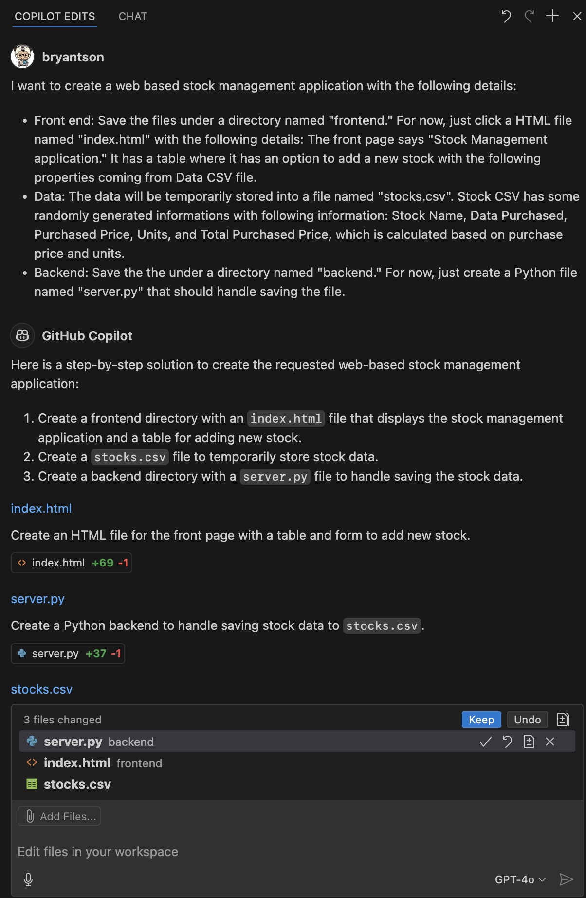

But the content itself can be very different because it is generative in nature. So, you may get different results each time you invoke it. On your main working area, you should see something like this:

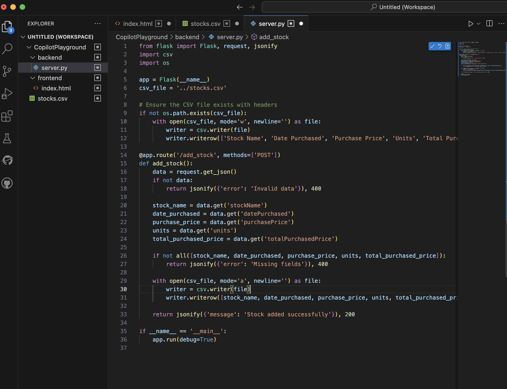

Accept all of those codes and save. Then, navigate to the directory where you saved the file. Find `index.html` and open it through your browser. You should see something like this:

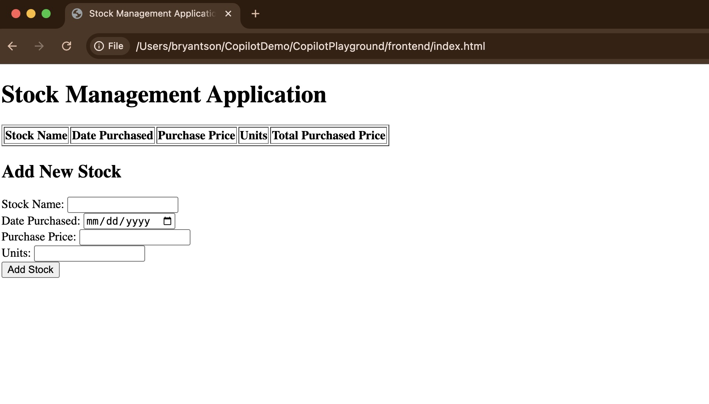

Why are we opening just `index.html`, not the entire thing? Well, `index.html` is always going to work as it is by simply displaying the webpage. If it go through the entire thing with things like Python, Java, database, or whatever, a chance is likely that we need to spend some time to debug. So, we are starting with a very simple example for now.

> **TIP:** Try to start with some simple example first. This might seem as it goes against what I said earlier about **Prompt Engineering**, but it is not. The reason is that we are trying to get a predictable result first, and then we can go deeper into the details. So, start with a simple example first and then go deeper into the details.

Next, let's go back to the Copilot Edit mode. You are likely to see three different files there added as **context**. Context is a very important concept to know when you work with Copilot. Sometimes, the result may surprise you because GitHub Copilot generates the result as it does not know a certain file exists when it actually does. So, it is important to know that Copilot Edit mode can use the context of the files you are working on. You can add or remove files from the context as you wish.

> **TIP:** To get more precise answer that meets your expectation, try to add or remove files from the context. This will help Copilot Edit mode to generate more relevant results based on the context you provided.

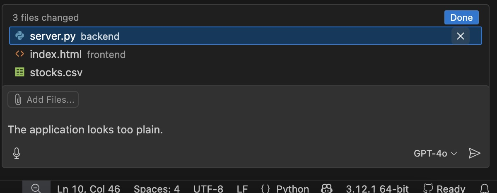

Let's remove `server.py` and `stocks.csv` files from the context. To do this, click on the **X** button next file in the Copilot Edit mode window. You should only have `index.html` file in the context.

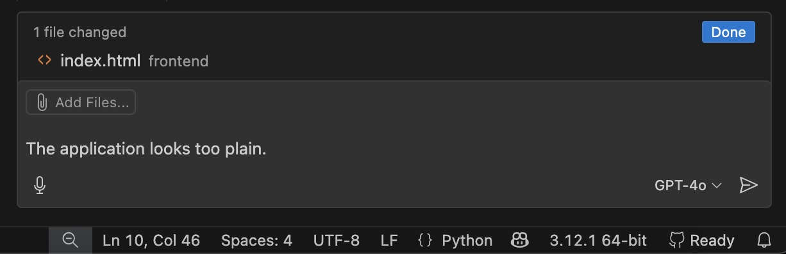

For the next step, we want to make the webpage little fancier. So, we will ask to add a Bootstrap library by asking the following question:

```markdown
The application looks too plain. Can you make it look better with importing Bootstrap?
```

For this prompt, however, you can add more detail or adjust a bit to your liking. The goal is to make the webpage look better with Bootstrap library.

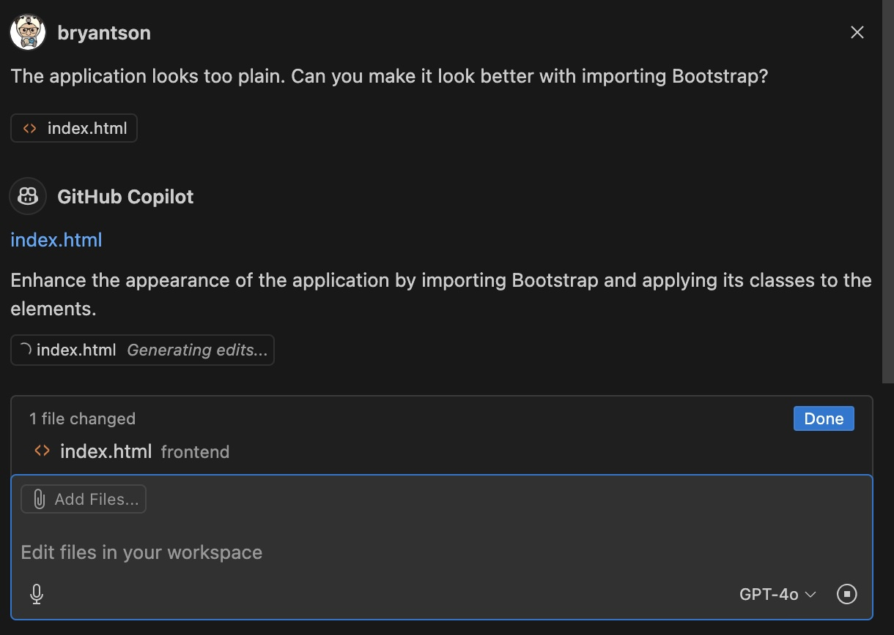

That prompt will generate a code like this:

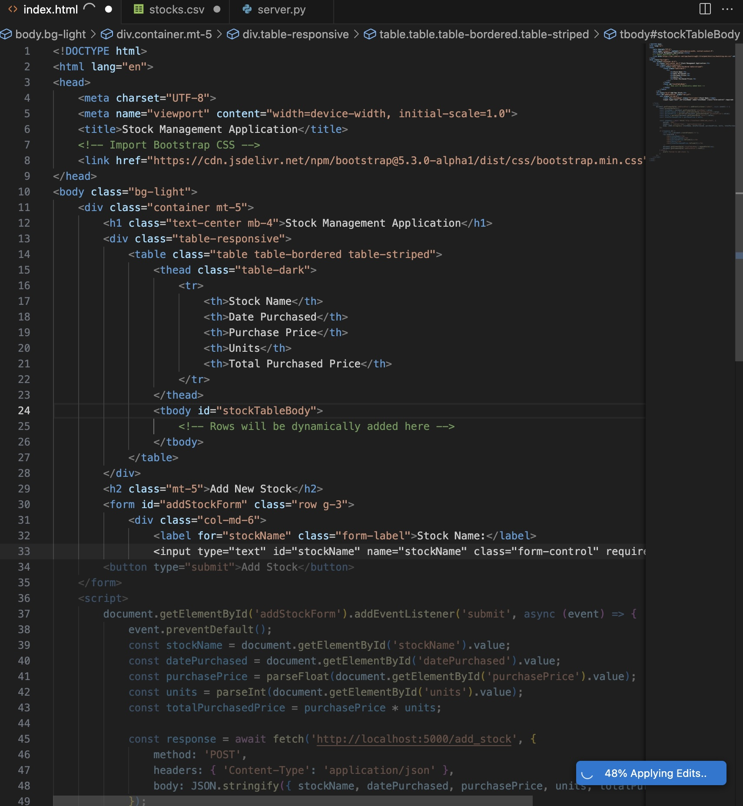

Once you accepted the code and saved, let's go back to your webpage and refresh it. You should see something like this:

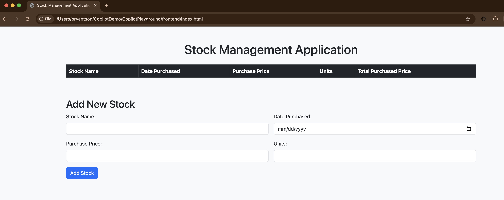

Great! That looks much better now. Again, yours may look different because it is generative in nature.

As a next step, we will ask to start the application. Add back other two files `server.py` and `stocks.csv` to the context. Then, ask the following question:

```markdown
Alright. How can I start this application so I can make it work?
```

Again, you can ask this in a different way, but the goal is to get the instruction on how to start the application. You will see something like this:

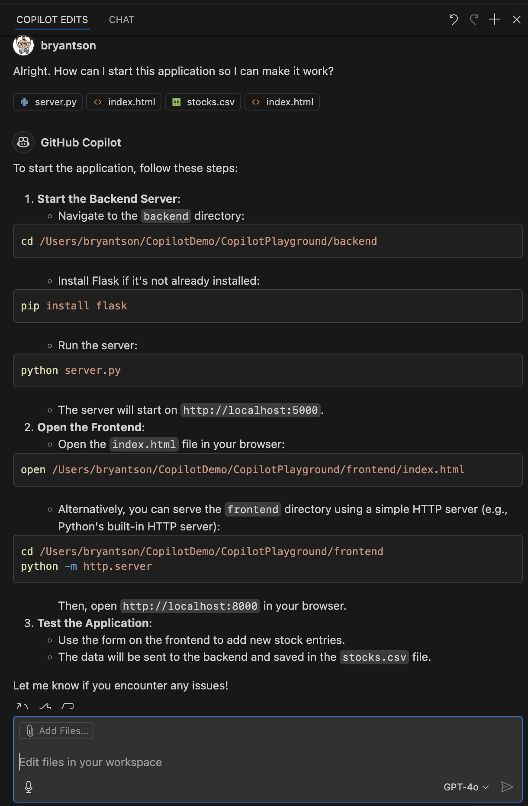

When you observe the generated result, you should be able to hover your mouse over the code. That will bring a pop-up window where you can see one option is `Insert into Terminal`. Make sure to open a terminal window in Visual Studio Code. You can do this by clicking on the **Terminal** menu and selecting **New Terminal** from the dropdown menu. This will open a new terminal window at the bottom of the Visual Studio Code window. Then. click that button.

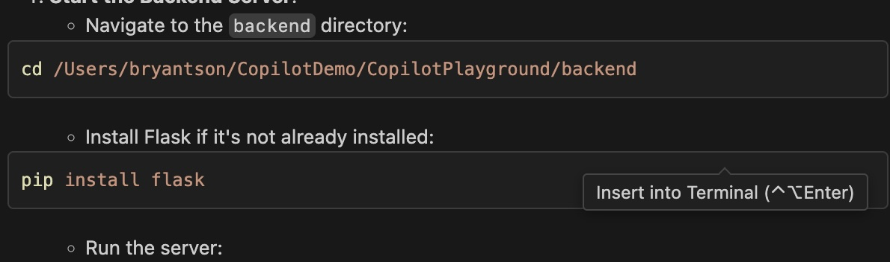

You will see that the code is inserted into the terminal. You can hit the `Enter` key to run the code.

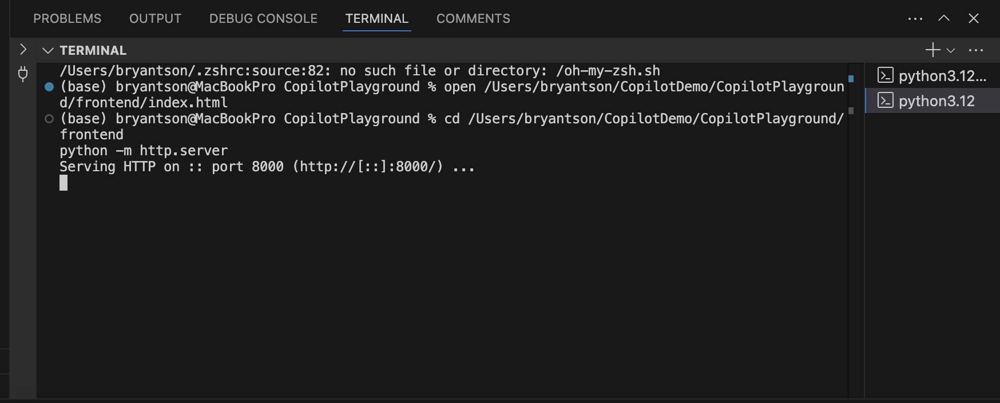

At this point, you might wonder `hey, this is little inconvenient. Why Do I need to ask GitHub Copilot how to start, click the button, and figure out by myself? Why can't it just run the code for me?` Well, that is a good question. This is where the **Agent mode** comes in. The Agent mode is a more advanced version of the Copilot Edit mode that can actually run the code for you. However, this feature is not yet available in the current version of GitHub Copilot. Stay tuned!

Let's go back to our browser and test out our application based on the instruction you got.

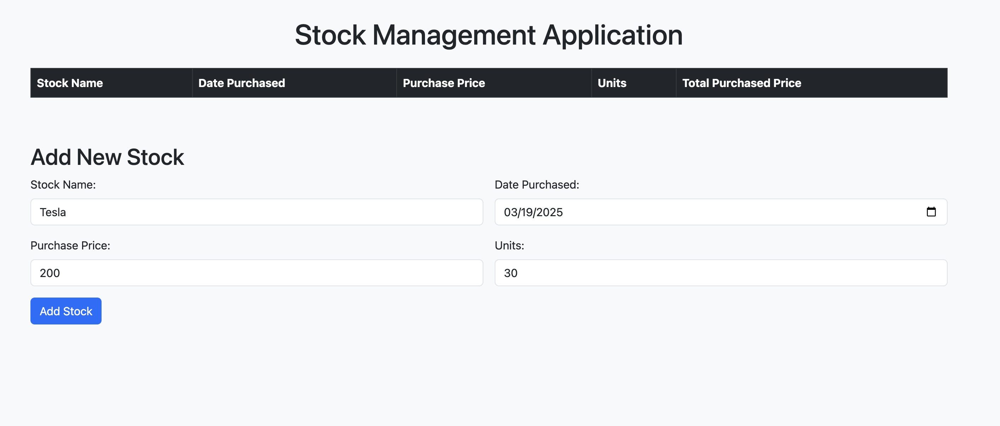

Now, you may see that the result looks quite different. Yours might work on the first try. But for some others, it may not work as expected. This is because the code is generative in nature and it can generate different results each time you invoke it. So, if you see that the result does not work as expected, try to debug it by looking at the code and see if there are any errors. You can also ask GitHub Copilot to help you debug the code by asking questions like `Can you help me debug this code?` or `What is wrong with this code?`.

You can also debug by using a tool like **Developer mode** or something similar like this.

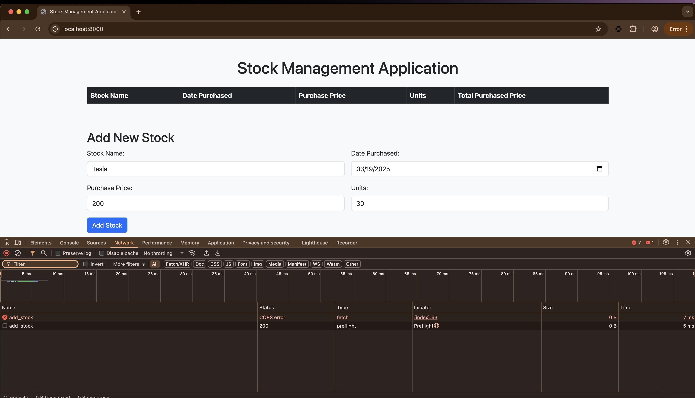

That is it for our stock management application example. Here are some homeworks for you to try out:

- [ ] Try to make the application actually work! This requires for you to implement the backend and make it work with the frontend. You can ask GitHub Copilot to help you with this by asking questions like `Can you implement the backend for this application?` or `How can I make this application work?`.
- [ ] Try to add things like chart for graphing the stock prices. You can ask GitHub Copilot to help you with this by asking questions like `Can you add a chart to this application?` or `How can I graph the stock prices?`.
- [ ] You may also want to grab the actual stock price data. This may requires to access the public API that has those data, which may also require you to sign up for an account. You can ask GitHub Copilot to help you with this by asking questions like `Can you help me access the public API?` or `How can I get the stock price data?`.
- [ ] You may also want to change the data storage from CSV to a database. You can ask GitHub Copilot to help you with this by asking questions like `Can you help me change the data storage from CSV to a database?` or `How can I use a database for this application?`.

That is it! I hope you enjoyed this tutorial and learned how to use the GitHub Copilot Edit mode effectively. Happy coding with GitHub Copilot!